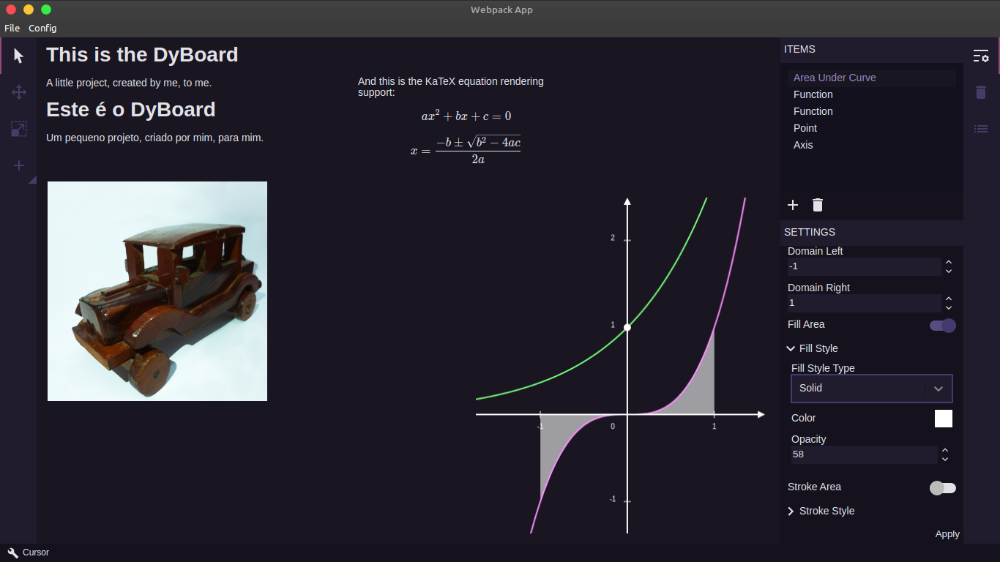

# DyBoard



This is my own (in development) digital blackboard personal project.

## Observation

This is constructed using the [electron-typescript-react](https://github.com/diego3g/electron-typescript-react) from @diego3g.

## Installation

Use a package manager of your choice (npm, yarn, etc.) in order to install all dependencies

```bash
npm install
```

```bash
yarn install
```

## Usage

In order to run this project 2 scripts will need to be executed `dev:react` and `dev:electron`, run each one in a different terminal and always run `dev:react` before `dev:electron`, or `dev` to run them in order automatically

```bash
npm run dev:react
```

```bash
npm run dev:electron
```

or

```bash
npm run dev
```

## Packaging

To generate a project package run `package`

```bash
npm run package
```
